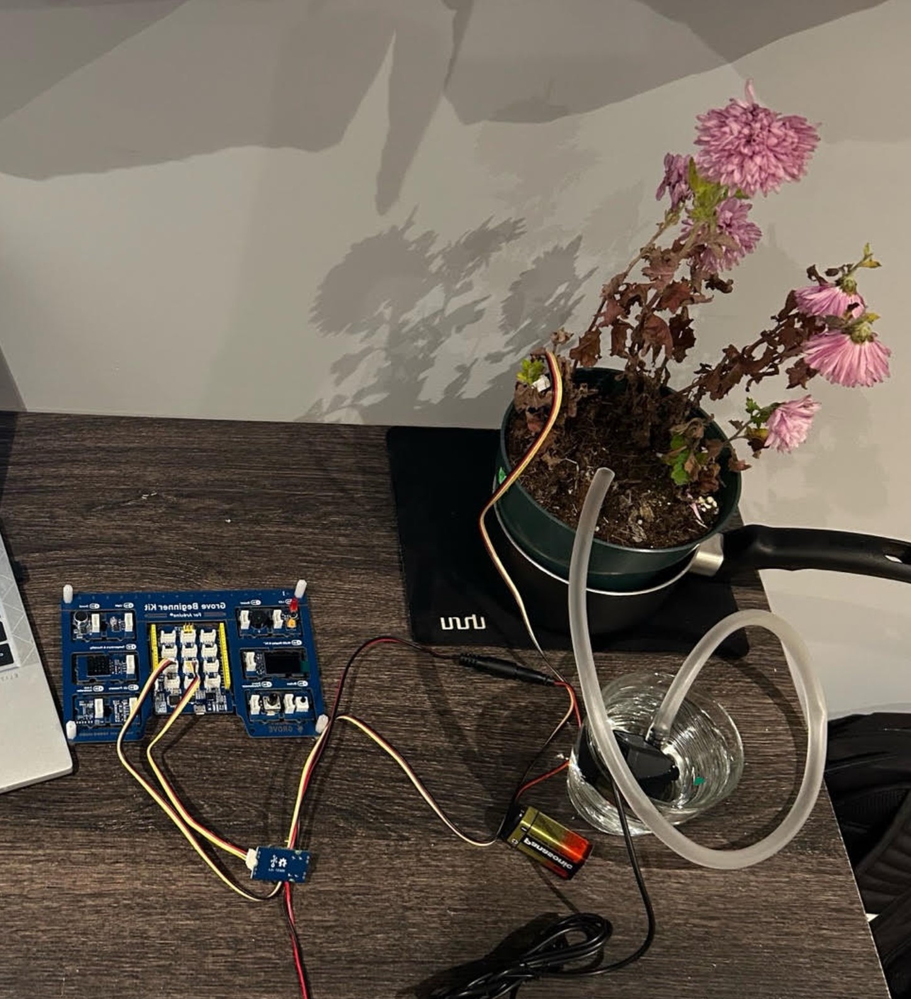

# Automated Plant Watering System

This project is an automated plant watering system I built using Java and an Arduino Grove beginner Kit.

The goal was to create a system that could monitor the moisture level of soil and automatically water a plant when it became too dry. A moisture sensor collects readings from the soil, then the Java program uses those readings and decides when the water pump should turn on or off.

## Here's How It Works

The moisture sensor continuously sends readings from the soil to Arduino. Using Firmata4j, my program reads this data and compares it to a moisture threshold.

if the soil is too dry, the program turns on the water pump. Once the soil has enough moisture, the pump stays off.

I also stored the moisture readings in an ArrayList and used them to create a live graph so I could see how the readings changed over time.

## Technologies I've Used
- Java
- Firmata4j
- Princeton StdDraw
- Arduino IDE

## The Hardware
- Moisture sensor
- Arduino Grove Beginner Kit
- Water pump
- MOSFET board
- 8V battery
- Micro USB to USB A connection

## Testing

I tested the moisture sensor in different conditions, including dry soil, damp material, and water to see how the readings changed.

During the testing, I found out that my sensor readings behaved differently than I originally expected. Dry conditions were producing higher readings while wet conditions produced lower readings.

After comparing readings under different conditions, I adjusted the threshold logic in my Java code by reversing the comparison used to determine when the pump should activate. After making this change the system was able to respond correctly to my sensor readings.

I also tested analog values within the expected 0-1023 range to make sure the program handled the sensor input correctly.
